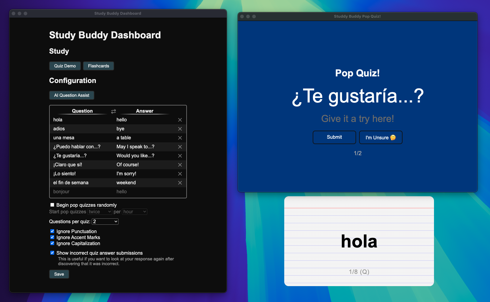

# Electron Study Buddy

_This project is still in development. The app may behave in unexpected ways, and it likely has some bugs. At the time of writing, it has only been tested on macOS and may not work on other operating systems._



## Overview

### About

I've been looking for a tool to assist with studying. As such, I built Electron Study Buddy, an Electron app that lives on your desktop and helps you study. This app was primarily built with foreign language courses in mind, but it can work with other subjects, too. (With that said, I'm sure it works better for some subjects than others. I encourage you to read a bit about the app, and if it sounds interesting, consider giving it a try for a subject you're trying to study!)

### Why?

There's already various studying tools out there, and these large companies undoubtedly have more expertise in building these tools than I do. However, due to the paywalls being added to some of these online studying tools (yes, I'm looking at [Quizlet](https://quizlet.com/)), I decided to have my own attempt at making a studying app.

One of the biggest challenges in building a tool like this is figuring out how to make it an _effective_ studying tool. Being a student myself, I already have some idea of what I want in an app like this. However, I'm certainly no expert when it comes to understanding the best ways to get the brain to retain information. This is simply my best first attempt at creating an effective tool for this.

### Requirements

I have a few primary "requirements" for this app in order for me to consider it useful:

- The app should allow the user to _easily_ add studying materials to the app.
  - For example, if the user is using a physical textbook for a foreign language class (an assumption I will use for the remainder of this overview), they should NOT need to manually type all of the vocabulary.
    - Some might argue that this is an effective memory technique. While that is undoubtedly true, the user can easily copy their vocabulary into any text editor, and that user probably does not need an entirely separate app for this functionality.
- The app should encourage the user to study.
  - In many cases, it doesn't take many minutes of studying per day to memorize vocabulary. Sometimes the most difficult part is setting aside this time each day to study a particular subject. It's easy to say "I'm awfully busy with _[class 1]_, so I'll study _[class 2]_ later." This app must mitigate that problem to some degree.
- The app should provide useful studying techniques.
  - Everyone's mind works differently! This app cannot be the perfect studying solution for every person (I wish it could be!). However, it _does_ need to offer more than what you could get from simply reading the textbook repeatedly. It does not necessarily need to introduce a novel new solution to studying—many classic studying methods are tried and true, and those can certainly be utilized. It just needs to _work._
  - This is arguably the most important requirement. To some degree, it also encapsulates the other requirements.

### Understanding the App

I've talked a lot about what I want from this app. But what actual functionality does it currently have?

The following are some key feaures of the app, ordered respective to the problems they solve from the prior "Requirements" bullet points.

- AI
  - Powered by OpenAI's [GPT-4o](https://platform.openai.com/docs/models/gpt-4o) vision capabilities, the AI feature ("AI Question Assist") automatically generates questions from pictures that the user uploads. This allows the user to upload pictures of their textbook and receive questions generated directly from that image.
  - Admittedly, even these LLMs are not perfect! In light of this, the user has the ability to review and exclude certain generated questions before importing these into their full list of questions.
    - To improve accuracy, the user can also specify custom instructions for the generation. As an example, the user might specify that sections of the textbook highlighted in red are provided as examples of what not to do, and as such, questions should not be generated from those sections.
- Random "pop quizzes"
  - The user can optionally enable random pop quizzes from within the dashboard. If enabled, the frequency of pop quizzes can be customized (e.g. twice per hour, once per 6 hours, etc.), and the pop quizzes will appear at random times within that interval.
    - Random pop quizzes can only open while the app is currently running. The quiz opens as the frontmost window, directly below the system tray. The quiz does not close until the user correctly answers all the questions.
    - The user will be asked questions taken from their full list of questions. The number of questions per quiz can also be customized from within the dashboard. At the end of the quiz, the user is given a score to provide an idea of how well they're mastering the material.
  - Pop quizzes can also be manually opened. I think a lot of their usefulness, though, comes from utilizing the randomness of it! This helps to ensure that the user studies every day (or at least every day that they're using their computer).
- Flashcards

  - In addition to random and/or manual quizzes, the user can open "flashcards" containing all of their questions. Flashcards attempt to closely simulate what it's like to study with physical 3x5in flashcards. Each flashcard has one question, with the answer on the back, and it can be flipped by clicking the flashcard. Forwards and backwards buttons can be clicked to move through the stack of flashcards.

## Usage

Though I have not yet packaged the application, running the app is rather simple.

### Installation

_These instructions require that you have already installed [Git](https://git-scm.com/downloads) and [Node.js](https://nodejs.org/en/download/package-manager)._

```
git clone https://github.com/TechPandaPro/electron-study-buddy.git
cd electron-study-buddy
npm install
```

### Running the App

You can start the Electron app by running `npm start`. Electron Study Buddy should then open.

_If you want to use the AI Question Assist feature, your OpenAI API key is added within the app's UI. It does **NOT** need to be added to a .env file._
